# E-Commerce-Back-End

## Badge
[]
 

## Table of Contents
- [Description](#description)
- [Screenshots](#screenshots)
- [Usage](#usage)
- [What I Have Learned](#what-i-have-learned)
- [Credits](#credits)
- [Licenses](#licenses)
 

## Description
Challenge 13 coursework for UT bootcamp. Uses Express.js, MySQL2, Sequelize, DotENV, as  
well as MySQL Workbench to host the schema(s) of the database.  
This application is to test the backend of an e-commerce site,  
seeding an SQL database with data, and testing GET, PUT, POST, and DELETE (CRUD)  
functionality on three routes (Category, Product, and Tag), with ThunderClient.  

## Screenshots
---Seeding the database---  
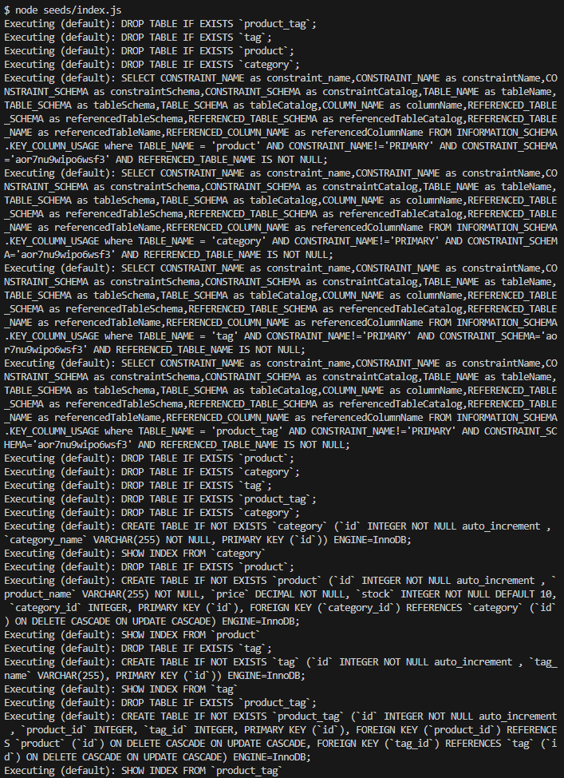

---Syncing the database (database key cropped out)---  
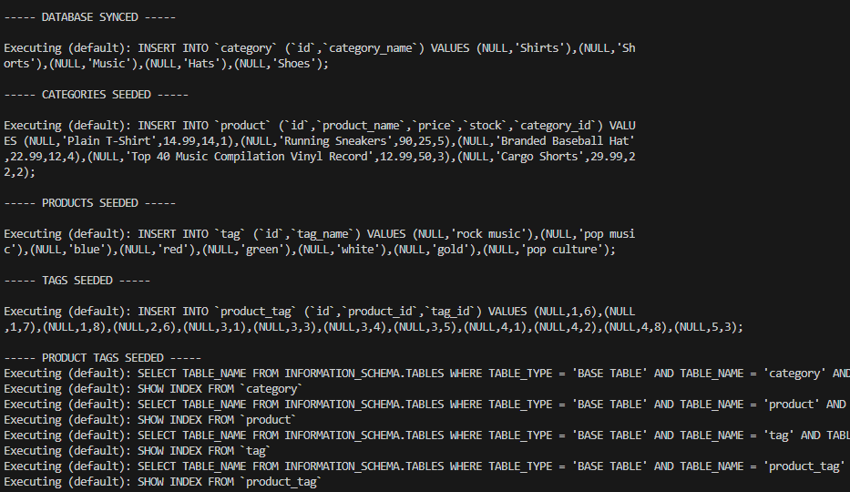

---Category data in MySQL Workbench---  
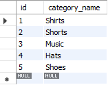

---Product data in MySQL Workbench---  
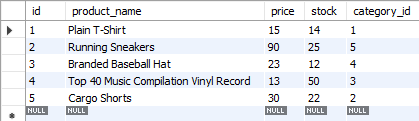

---ProductTag data in MySQL Workbench---  
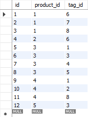

---Tag data in MySQL Workbench---  
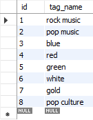

---Categories---  
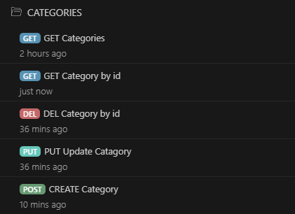

---Products---  
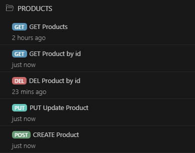

---Tags---  
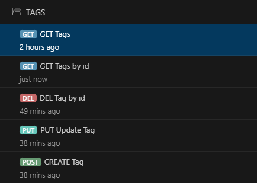

---ThunderClient GET Test (of many)---  
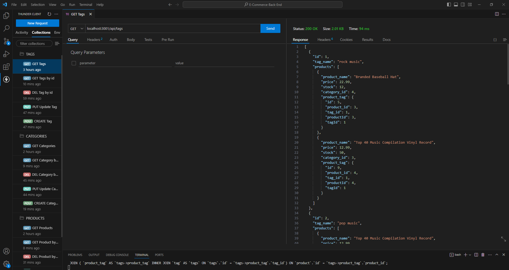

---ThunderClient DEL Test (of many)---  
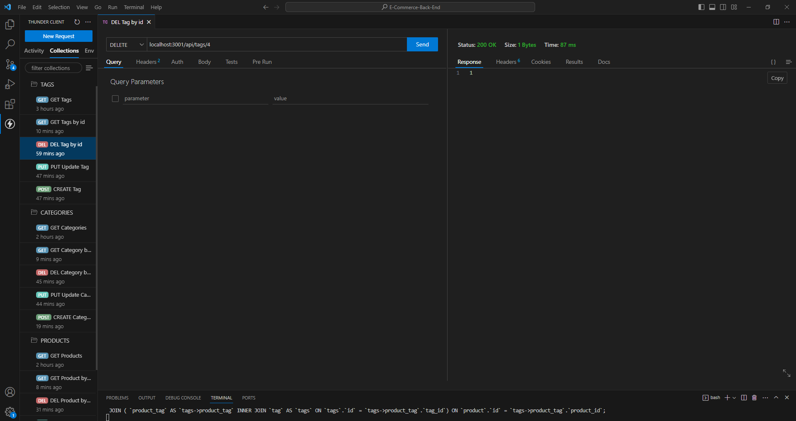

---ThunderClient PUT Test (of many)---  
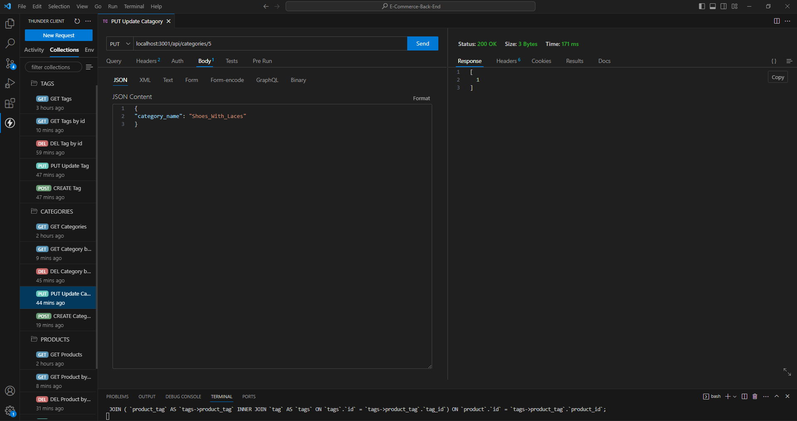

---ThunderClient POST Test (of many)---  
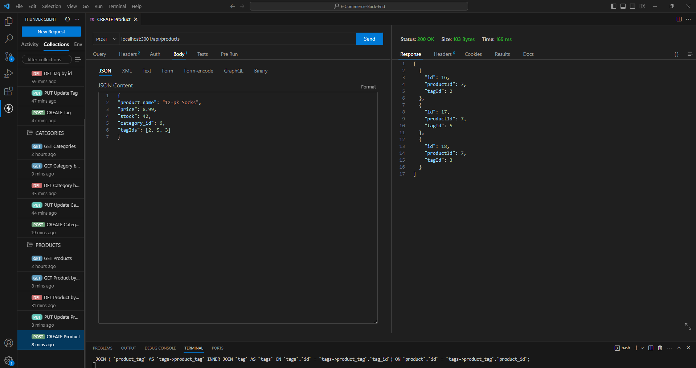

## Usage
Simply click on the link and watch the magic happen.    
Link to the website: https://drive.google.com/file/d/1CK47ZDP_lPZwOIoNg01Abys3q37WaQL4/view  

## What I Have Learned
I have learned about using Node to seed directly inside of the command line terminal,  
being able to construct GET, PUT, POST, and DELETE functions for each of the routes,  
as well as testing routes with ThunderClient to see if CRUD works properly.  

## Credits
Made by Allie Stewart.  
Helpful notes from the module 13 activities, as well as  
help from https://stackoverflow.com.  

## Licenses
Please refer to the LICENSE in the repository.  
